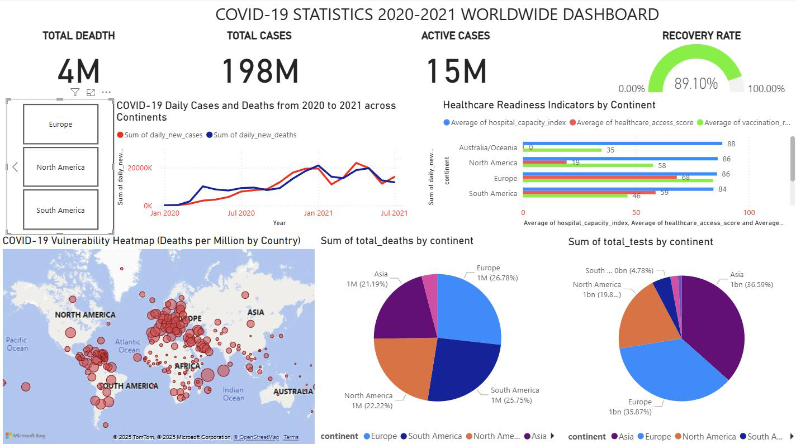
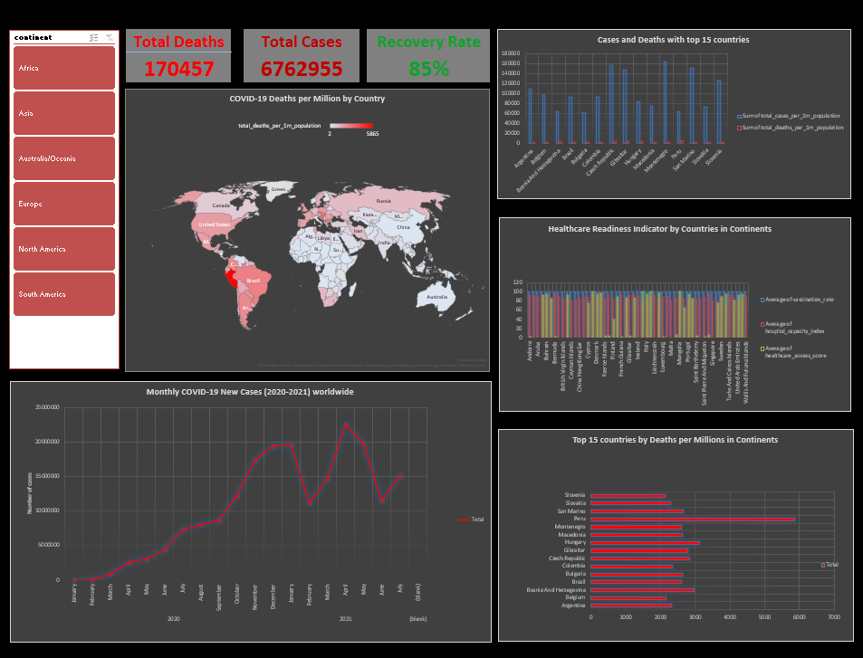
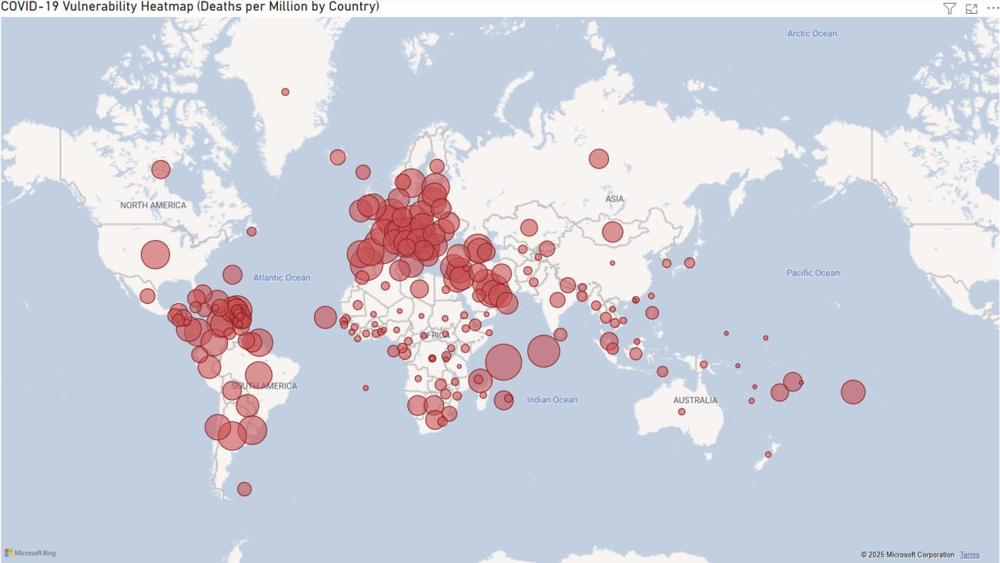
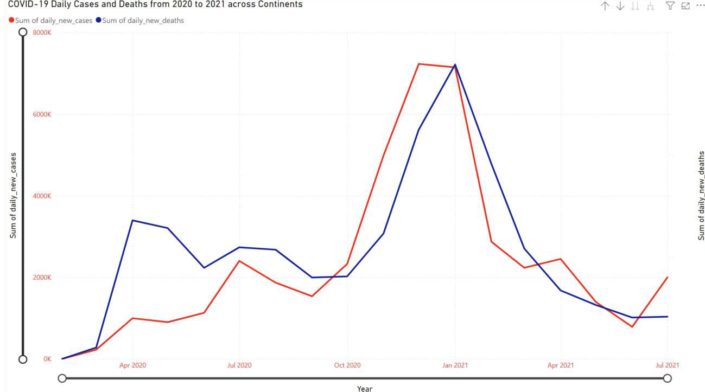
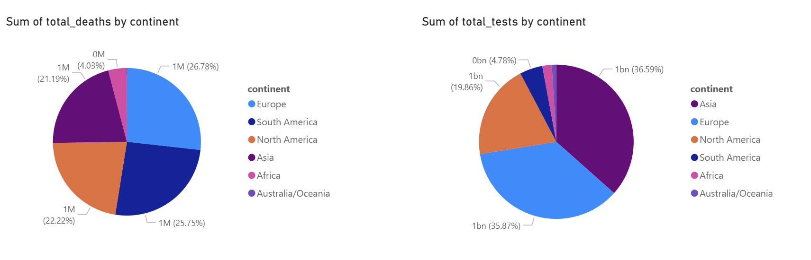

# Global COVID-19 Health Analytics

An end-to-end business analytics portfolio project using **Microsoft Excel** and **Power BI** to analyse global COVID-19 outcomes, healthcare readiness, vaccination coverage, testing capacity, mortality, recovery performance, and regional vulnerability.

<p align="center">
  
</p>

## Project Overview

This project was developed for **BUS5PB – Principles of Business Analytics**. The analysis was designed to support evidence-based decision-making by transforming historical COVID-19 data into clear, actionable insights for the **World Health Organization (WHO)**.

The project combines descriptive analysis in Excel with interactive and diagnostic analysis in Power BI. It examines differences between continents in confirmed cases, deaths, testing, vaccination, healthcare access, hospital capacity, and recovery outcomes.

## Business Problem

COVID-19 affected countries unevenly. Some regions recorded high infection rates but relatively low mortality, while others experienced high death-to-case ratios because of limited healthcare capacity, lower vaccination coverage, and weaker testing systems.

The analysis addresses the following questions:

1. How did COVID-19 cases and deaths differ across continents?
2. How did healthcare readiness vary between countries and regions?
3. Which countries and continents showed the highest vulnerability?
4. How did the pandemic evolve over time?
5. How did testing, vaccination, and healthcare capacity influence mortality and recovery?
6. Where should global health resources be prioritised?

## Tools and Technologies

### Microsoft Excel

- Data preparation
- PivotTables
- PivotCharts
- Descriptive analysis
- Dashboard development

### Microsoft Power BI

- Data modelling
- Interactive visualisations
- Time-series analysis
- Geographic mapping
- KPI cards
- Filters and slicers
- Diagnostic analysis

## Analytical Workflow

1. Reviewed and prepared the COVID-19 dataset.
2. Selected indicators related to cases, deaths, vaccination, testing, hospital capacity, healthcare access, and recovery.
3. Used Excel PivotTables and PivotCharts to compare countries and continents.
4. Built an Excel dashboard for descriptive analysis.
5. Developed an interactive Power BI dashboard.
6. Analysed regional vulnerability, mortality, testing disparities, and recovery performance.
7. Converted analytical findings into recommendations for global health resource allocation.

## Dashboard Preview

### Power BI Dashboard

<p align="center">
  
</p>

### Excel Dashboard

<p align="center">
  
</p>

## Key Visualisations

### Global COVID-19 Vulnerability Heatmap

The geographic heatmap compares deaths per million across countries. Larger bubbles represent higher mortality relative to population and help identify regions with greater vulnerability.

<p align="center">
  
</p>

### Pandemic Timeline

The time-series visual tracks changes in daily new cases and daily new deaths from 2020 to mid-2021. It highlights major pandemic waves and the decline in mortality following broader vaccine distribution.

<p align="center">
  
</p>

### Testing and Mortality Disparities

This comparison shows the distribution of total deaths and total tests across continents. It highlights regions where low testing levels may have contributed to under-detection and weaker outbreak surveillance.

<p align="center">
  
</p>

## Key Findings

- Europe and the Americas recorded some of the highest confirmed case burdens.
- South America experienced particularly high mortality, with Peru showing an exceptionally high death rate per million.
- Africa reported fewer confirmed cases but showed signs of under-testing and limited healthcare capacity.
- Europe and North America generally had stronger vaccination coverage, healthcare access, and hospital capacity.
- Africa and parts of Oceania had lower vaccination coverage and weaker healthcare access.
- Regions with earlier and broader vaccine distribution experienced faster reductions in mortality.
- Testing capacity was concentrated in Asia, Europe, and North America, while Africa and South America conducted substantially fewer tests.
- High case numbers alone did not fully represent vulnerability; mortality ratios, healthcare readiness, and recovery capacity provided a more complete picture.

## Recommendations

Based on the findings, the project recommends:

- Expanding hospital and intensive-care capacity in vulnerable regions.
- Improving oxygen supply chains and emergency healthcare services.
- Strengthening vaccine access and distribution in low-coverage countries.
- Investing in affordable testing and standardised disease surveillance systems.
- Supporting community healthcare workers and local health organisations.
- Improving consistency and completeness in international health data reporting.

## Project Report

The complete academic report includes the methodology, dashboard analysis, findings, recommendations, limitations, references, and appendices.

[📄 View the full project report](covid19-global-health-analytics/report/Covid-19 Analytics Report.pdf)

## Repository Structure

```text
covid19-global-health-analytics/
│
├── README.md
│
├── images/
│   ├── powerbi-dashboard-full.png
│   ├── excel-dashboard-full.png
│   ├── figure-12-covid19-vulnerability-heatmap.png
│   ├── figure-13-pandemic-timeline.png
│   ├── figure-14-testing-vs-mortality.png
│   └── additional-analysis-images.png
│
└── report/
    └── BUS5PB-COVID19-Analytics-Report.pdf
```

## Skills Demonstrated

- Business analytics
- Data preparation
- Data visualisation
- Dashboard development
- Excel PivotTables and PivotCharts
- Power BI reporting
- Time-series analysis
- Geographic analysis
- KPI development
- Insight communication
- Evidence-based recommendations

## Limitations

The dataset contains differences in national reporting standards, possible under-reporting, missing values, and limited socioeconomic indicators. Therefore, the results should be interpreted as analytical evidence rather than a complete representation of the pandemic's true global impact.

## Author

**Chanh Minh Dat Luc**  

---

*This repository is presented as a data analytics portfolio project for educational and professional purposes.*
